# Modelo de datos

Diseno de la base PostgreSQL 17 (D18). Cubre la estructura organizacional (enunciado 3.2),
el catalogo de servicios (3.3), las sesiones (3.1, D16) y la trazabilidad de la
importacion (3.4, D13). Las reglas que no caben en una restriccion de la base estan en
[reglas.md](reglas.md); la lectura del Excel, en [mapeo-excel.md](mapeo-excel.md).

Convenciones que valen para todas las tablas:

- Nombres en espanol, minusculas y `snake_case`, sin acentos.
- Llave primaria `id`, `bigint GENERATED ALWAYS AS IDENTITY`. Los catalogos usan
  `smallint` porque tienen pocas filas.
- Toda llave foranea es `ON DELETE RESTRICT ON UPDATE RESTRICT`. La aplicacion no borra
  filas: las bajas son logicas (columna `activo`).
- `creado_en` y `actualizado_en` son `timestamptz NOT NULL DEFAULT now()`. `actualizado_en`
  lo pone la aplicacion en cada `UPDATE`.
- Los textos obligatorios llevan `CHECK (btrim(col) <> '')`. Los codigos que se escriben
  desde la aplicacion llevan ademas `CHECK (col = btrim(col))`, para que `"SE.01 "` y
  `"SE.01"` no convivan como codigos distintos.
- Los codigos se comparan tal cual, sin pasar a mayusculas.

## Diagrama entidad relacion

```mermaid
erDiagram
    EMPRESA ||--o{ AREA : contiene
    AREA ||--o{ DEPARTAMENTO : contiene
    DEPARTAMENTO ||--o{ SECCION : contiene
    SECCION ||--o{ PUESTO : contiene
    PUESTO ||--o{ USUARIO : ocupa
    USUARIO ||--o{ SESION : abre

    SERVICIO_N1 ||--o{ SERVICIO_N2 : agrupa
    CLASE_SERVICIO |o--o{ SERVICIO_N2 : clasifica
    CRITICIDAD |o--o{ SERVICIO_N2 : pondera
    TIPO_SERVICIO |o--o{ SERVICIO_N2 : tipifica
    SECCION |o--o{ SERVICIO_N2 : "es responsable de"
    USUARIO |o--o{ SERVICIO_N2 : "es responsable de"

    USUARIO |o--o{ IMPORTACION : ejecuta
    IMPORTACION ||--o{ INCIDENCIA : registra
    IMPORTACION |o--o{ SERVICIO_N1 : "ultima carga"
    IMPORTACION |o--o{ SERVICIO_N2 : "ultima carga"
    IMPORTACION |o--o{ CLASE_SERVICIO : "ultima carga"
    IMPORTACION |o--o{ CRITICIDAD : "ultima carga"
    IMPORTACION |o--o{ TIPO_SERVICIO : "ultima carga"
    SERVICIO_N1 |o--o{ INCIDENCIA : "afectado por"
    SERVICIO_N2 |o--o{ INCIDENCIA : "afectado por"

    EMPRESA {
        bigint id PK
        text codigo UK
        text nombre
        boolean activo
        timestamptz creado_en
        timestamptz actualizado_en
    }
    AREA {
        bigint id PK
        bigint empresa_id FK
        text codigo "UK con empresa_id"
        text nombre
        boolean activo
        timestamptz creado_en
        timestamptz actualizado_en
    }
    DEPARTAMENTO {
        bigint id PK
        bigint area_id FK
        text codigo "UK con area_id"
        text nombre
        boolean activo
        timestamptz creado_en
        timestamptz actualizado_en
    }
    SECCION {
        bigint id PK
        bigint departamento_id FK
        text codigo "UK con departamento_id"
        text nombre
        boolean activo
        timestamptz creado_en
        timestamptz actualizado_en
    }
    PUESTO {
        bigint id PK
        bigint seccion_id FK
        text codigo "UK con seccion_id"
        text nombre
        boolean activo
        timestamptz creado_en
        timestamptz actualizado_en
    }
    USUARIO {
        bigint id PK
        bigint puesto_id FK
        text nombre
        text usuario UK
        text correo UK
        text hash_contrasena
        text rol
        boolean activo
        timestamptz creado_en
        timestamptz actualizado_en
    }
    SESION {
        bigint id PK
        bigint usuario_id FK
        bytea token_hash UK
        timestamptz creada_en
        timestamptz expira_en
        timestamptz revocada_en
    }
    SERVICIO_N1 {
        bigint id PK
        text codigo UK
        text nombre
        boolean activo
        text origen_hoja
        text origen_rango
        jsonb origen_valores
        text origen_hash
        bigint importacion_id FK
        timestamptz creado_en
        timestamptz actualizado_en
    }
    SERVICIO_N2 {
        bigint id PK
        bigint servicio_n1_id FK
        text codigo UK
        text nombre
        text activo "S, N o DESCONOCIDO"
        smallint clase_id FK
        smallint criticidad_id FK
        smallint tipo_id FK
        text descripcion
        text metrica
        numeric minimo
        numeric maximo
        bigint seccion_responsable_id FK
        bigint usuario_responsable_id FK
        boolean requiere_revision
        text origen_hoja
        text origen_rango
        jsonb origen_valores
        text origen_hash
        bigint importacion_id FK
        timestamptz creado_en
        timestamptz actualizado_en
    }
    CLASE_SERVICIO {
        smallint id PK
        text nombre UK
        text valor_origen UK
        text origen_celda
        smallint orden
        boolean activo
        bigint importacion_id FK
        timestamptz creado_en
        timestamptz actualizado_en
    }
    CRITICIDAD {
        smallint id PK
        text nombre UK
        text valor_origen UK
        text origen_celda
        smallint orden
        boolean activo
        bigint importacion_id FK
        timestamptz creado_en
        timestamptz actualizado_en
    }
    TIPO_SERVICIO {
        smallint id PK
        text nombre UK
        text valor_origen UK
        text origen_celda
        smallint orden
        boolean activo
        bigint importacion_id FK
        timestamptz creado_en
        timestamptz actualizado_en
    }
    IMPORTACION {
        bigint id PK
        bigint usuario_id FK
        text origen
        text estado
        text archivo_ruta
        text archivo_sha256
        text hoja
        integer creados
        integer actualizados
        integer omitidos
        integer observados
        jsonb detalle
        text mensaje_error
        timestamptz iniciada_en
        timestamptz finalizada_en
    }
    INCIDENCIA {
        bigint id PK
        bigint importacion_id FK
        text tipo
        text regla
        text hoja
        integer fila
        text celdas
        text codigo
        bigint servicio_n1_id FK
        bigint servicio_n2_id FK
        jsonb valor_original
        jsonb valor_aplicado
        text mensaje
        timestamptz creada_en
    }
```

Son 14 entidades. Las 14 tienen su tabla en el diccionario y el diccionario no tiene
ninguna que no este en el diagrama.

## Diccionario de datos

En la columna "Nulo", **NN** quiere decir `NOT NULL` y **N** quiere decir que admite nulo.

### Estructura organizacional

La jerarquia es Empresa, Area, Departamento, Seccion, Puesto y Usuario (enunciado 3.2).
Cada nivel tiene un solo padre, obligatorio. Las cinco unidades comparten forma; cambian
el padre y el alcance de la unicidad del codigo.

#### `empresa`

| Columna | Tipo | Nulo | Llave / restriccion | Descripcion |
|---|---|---|---|---|
| `id` | `bigint` identity | NN | PK | Identificador. |
| `codigo` | `text` | NN | `UNIQUE (codigo)`; `CHECK` de texto no vacio y sin espacios en los extremos | Codigo de la empresa, unico en todo el sistema. |
| `nombre` | `text` | NN | `CHECK (btrim(nombre) <> '')` | Nombre. |
| `activo` | `boolean` | NN | `DEFAULT true` | Estado. `false` es la baja logica. |
| `creado_en` | `timestamptz` | NN | `DEFAULT now()` | Alta del registro. |
| `actualizado_en` | `timestamptz` | NN | `DEFAULT now()` | Ultima modificacion. |

#### `area`

| Columna | Tipo | Nulo | Llave / restriccion | Descripcion |
|---|---|---|---|---|
| `id` | `bigint` identity | NN | PK | Identificador. |
| `empresa_id` | `bigint` | NN | FK `empresa(id)` | Empresa a la que pertenece. |
| `codigo` | `text` | NN | `UNIQUE (empresa_id, codigo)`; `CHECK` de codigo | Codigo, unico dentro de su empresa. |
| `nombre` | `text` | NN | `CHECK` no vacio | Nombre. |
| `activo` | `boolean` | NN | `DEFAULT true` | Estado. |
| `creado_en` | `timestamptz` | NN | `DEFAULT now()` | Alta. |
| `actualizado_en` | `timestamptz` | NN | `DEFAULT now()` | Ultima modificacion. |

Indice: el `UNIQUE (empresa_id, codigo)` sirve tambien para listar las areas de una empresa.

#### `departamento`

| Columna | Tipo | Nulo | Llave / restriccion | Descripcion |
|---|---|---|---|---|
| `id` | `bigint` identity | NN | PK | Identificador. |
| `area_id` | `bigint` | NN | FK `area(id)` | Area a la que pertenece. |
| `codigo` | `text` | NN | `UNIQUE (area_id, codigo)`; `CHECK` de codigo | Codigo, unico dentro de su area. |
| `nombre` | `text` | NN | `CHECK` no vacio | Nombre. |
| `activo` | `boolean` | NN | `DEFAULT true` | Estado. |
| `creado_en` | `timestamptz` | NN | `DEFAULT now()` | Alta. |
| `actualizado_en` | `timestamptz` | NN | `DEFAULT now()` | Ultima modificacion. |

#### `seccion`

| Columna | Tipo | Nulo | Llave / restriccion | Descripcion |
|---|---|---|---|---|
| `id` | `bigint` identity | NN | PK | Identificador. |
| `departamento_id` | `bigint` | NN | FK `departamento(id)` | Departamento al que pertenece. |
| `codigo` | `text` | NN | `UNIQUE (departamento_id, codigo)`; `CHECK` de codigo | Codigo, unico dentro de su departamento. |
| `nombre` | `text` | NN | `CHECK` no vacio | Nombre. |
| `activo` | `boolean` | NN | `DEFAULT true` | Estado. |
| `creado_en` | `timestamptz` | NN | `DEFAULT now()` | Alta. |
| `actualizado_en` | `timestamptz` | NN | `DEFAULT now()` | Ultima modificacion. |

#### `puesto`

| Columna | Tipo | Nulo | Llave / restriccion | Descripcion |
|---|---|---|---|---|
| `id` | `bigint` identity | NN | PK | Identificador. |
| `seccion_id` | `bigint` | NN | FK `seccion(id)` | Seccion a la que pertenece. |
| `codigo` | `text` | NN | `UNIQUE (seccion_id, codigo)`; `CHECK` de codigo | Codigo, unico dentro de su seccion. |
| `nombre` | `text` | NN | `CHECK` no vacio | Nombre. |
| `activo` | `boolean` | NN | `DEFAULT true` | Estado. |
| `creado_en` | `timestamptz` | NN | `DEFAULT now()` | Alta. |
| `actualizado_en` | `timestamptz` | NN | `DEFAULT now()` | Ultima modificacion. |

#### `usuario`

| Columna | Tipo | Nulo | Llave / restriccion | Descripcion |
|---|---|---|---|---|
| `id` | `bigint` identity | NN | PK | Identificador. |
| `puesto_id` | `bigint` | NN | FK `puesto(id)`; indice | Puesto que ocupa. Un puesto puede tener varios usuarios. |
| `nombre` | `text` | NN | `CHECK` no vacio | Nombre de la persona. |
| `usuario` | `text` | NN | `UNIQUE` sobre `lower(usuario)`; `CHECK (position('@' in usuario) = 0)`; `CHECK` de codigo | Nombre de inicio de sesion. No puede llevar `@`, asi no se confunde con un correo. |
| `correo` | `text` | N | `UNIQUE` sobre `lower(correo)` `WHERE correo IS NOT NULL`; `CHECK (correo IS NULL OR position('@' in correo) > 1)` | Correo. Opcional, y si esta sirve para iniciar sesion. |
| `hash_contrasena` | `text` | NN | `CHECK (hash_contrasena LIKE '$argon2id$%')` | Hash argon2id en formato PHC, con parametros y sal incluidos (D15). |
| `rol` | `text` | NN | `CHECK (rol IN ('administrador', 'consulta'))` | Rol. |
| `activo` | `boolean` | NN | `DEFAULT true` | Estado. Un usuario inactivo no puede iniciar sesion ni usar una sesion abierta. |
| `creado_en` | `timestamptz` | NN | `DEFAULT now()` | Alta. |
| `actualizado_en` | `timestamptz` | NN | `DEFAULT now()` | Ultima modificacion. |

`usuario` no tiene `empresa_id`. La empresa sale de la cadena
`usuario.puesto_id -> puesto.seccion_id -> seccion.departamento_id -> departamento.area_id -> area.empresa_id`,
asi que no puede haber una relacion contradictoria (enunciado 3.2). Las respuestas de la
API devuelven esa ruta completa como `jerarquia`.

`hash_contrasena` no sale nunca en una respuesta de la API, para ningun rol.

### Sesiones

#### `sesion`

| Columna | Tipo | Nulo | Llave / restriccion | Descripcion |
|---|---|---|---|---|
| `id` | `bigint` identity | NN | PK | Identificador. |
| `usuario_id` | `bigint` | NN | FK `usuario(id)`; indice | Usuario al que pertenece la sesion. |
| `token_hash` | `bytea` | NN | `UNIQUE`; `CHECK (octet_length(token_hash) = 32)` | SHA-256 del token que viaja en la cookie. El token en claro no se guarda (D16). |
| `creada_en` | `timestamptz` | NN | `DEFAULT now()` | Inicio de sesion. |
| `expira_en` | `timestamptz` | NN | `CHECK (expira_en > creada_en)` | Vencimiento absoluto. |
| `revocada_en` | `timestamptz` | N | | Momento del cierre de sesion o de la revocacion. Nulo mientras siga vigente. |

Una sesion es valida si `revocada_en IS NULL AND expira_en > now()` y su usuario tiene
`activo = true`. Las sesiones vencidas no se borran; quedan como historial.

### Catalogo de servicios

#### `clase_servicio`, `criticidad` y `tipo_servicio`

Las tres tablas tienen la misma forma. Se cargan desde `F112:F113`, `G112:G116` y
`H112:H122` tal como estan escritas, incluidas las opciones que no usa ninguna fila (D12).

| Columna | Tipo | Nulo | Llave / restriccion | Descripcion |
|---|---|---|---|---|
| `id` | `smallint` identity | NN | PK | Identificador. |
| `nombre` | `text` | NN | `UNIQUE`; `CHECK` no vacio | Etiqueta que muestra la aplicacion. El administrador la puede editar. |
| `valor_origen` | `text` | N | `UNIQUE` (admite varios nulos) | Texto exacto de la celda del Excel. Lo pone el importador y la API no lo deja modificar. Nulo si la opcion se creo en la aplicacion. |
| `origen_celda` | `text` | N | `CHECK ((valor_origen IS NULL) = (origen_celda IS NULL))` | Celda de donde salio, por ejemplo `H113`. |
| `orden` | `smallint` | NN | `CHECK (orden > 0)` | Orden de presentacion. En las importadas, el de la lista del Excel. |
| `activo` | `boolean` | NN | `DEFAULT true` | Si se ofrece en los formularios. |
| `importacion_id` | `bigint` | N | FK `importacion(id)` | Ultima importacion que creo o actualizo la fila. |
| `creado_en` | `timestamptz` | NN | `DEFAULT now()` | Alta. |
| `actualizado_en` | `timestamptz` | NN | `DEFAULT now()` | Ultima modificacion. |

Mapeo de etiquetas: el enunciado pide que cualquier correccion de etiqueta quede en un
mapeo. Ese mapeo son las filas donde `nombre <> valor_origen`, y se puede consultar en
cualquier momento. Despues de la importacion no hay ninguna, porque no se corrige nada
(D12). El importador busca siempre por `valor_origen`, nunca por `nombre`, asi que editar
una etiqueta no rompe la siguiente importacion.

`ACTIVO` (columna E, opciones `E112:E113`) no tiene tabla: es un dominio cerrado con un
tercer valor propio, `DESCONOCIDO` (D11). Ver `servicio_n2.activo`.

#### `servicio_n1`

| Columna | Tipo | Nulo | Llave / restriccion | Descripcion |
|---|---|---|---|---|
| `id` | `bigint` identity | NN | PK | Identificador. |
| `codigo` | `text` | NN | `UNIQUE (codigo)`; `CHECK` no vacio | `COD.N1`, texto tal cual (columna A). |
| `nombre` | `text` | NN | `CHECK` no vacio | `SERVICIO - Nivel 1` (columna B). Para `SE.12`, el canonico de `B99` (D09). |
| `activo` | `boolean` | NN | `DEFAULT true` | Estado del registro en la aplicacion. El Excel no trae indicador para el nivel 1; ver la nota de abajo. |
| `origen_hoja` | `text` | N | | Hoja de origen, `Servicios Externos`. Nulo si se creo en la aplicacion. |
| `origen_rango` | `text` | N | | Filas que abarca el nivel 1 en el Excel, por ejemplo `A5:B9` o `A99:B101`. |
| `origen_valores` | `jsonb` | N | | Valores leidos de las celdas, con su referencia. En `SE.12` incluye `B99` y `B100`. |
| `origen_hash` | `text` | N | `CHECK (origen_hash ~ '^[0-9a-f]{64}$')` | SHA-256 de `origen_valores` en forma canonica. Sirve para saber si el Excel cambio. |
| `importacion_id` | `bigint` | N | FK `importacion(id)` | Ultima importacion que lo creo o actualizo. |
| `creado_en` | `timestamptz` | NN | `DEFAULT now()` | Alta. |
| `actualizado_en` | `timestamptz` | NN | `DEFAULT now()` | Ultima modificacion. |

Restriccion de coherencia de origen:
`CHECK ((origen_hoja IS NULL) = (origen_hash IS NULL) AND (origen_hoja IS NULL) = (origen_valores IS NULL))`.

Nota sobre `activo`: el Excel no tiene columna `ACTIVO` para el nivel 1. Los servicios de
nivel 1 importados empiezan con `activo = true` porque figuran en el catalogo. Es el estado
del registro, no un atributo del Excel inventado, y el mapeo lo dice asi.

#### `servicio_n2`

| Columna | Tipo | Nulo | Llave / restriccion | Descripcion |
|---|---|---|---|---|
| `id` | `bigint` identity | NN | PK | Identificador. |
| `servicio_n1_id` | `bigint` | NN | FK `servicio_n1(id)`; indice | Servicio de nivel 1 al que pertenece. |
| `codigo` | `text` | NN | `UNIQUE (codigo)`; `CHECK` no vacio | `COD.N2` (columna C), texto sin normalizar. `SE.12.1` se queda como `SE.12.1`. |
| `nombre` | `text` | NN | `CHECK` no vacio | `SERVICIO - Nivel 2` (columna D). |
| `activo` | `text` | NN | `CHECK (activo IN ('S', 'N', 'DESCONOCIDO'))`; `DEFAULT 'S'` | `ACTIVO` (columna E). `DESCONOCIDO` si la celda esta vacia (D11). Tambien es la baja logica: desactivar pone `N`. |
| `clase_id` | `smallint` | N | FK `clase_servicio(id)`; indice | `CLASE DE SERVICIO` (columna F). Nulo si falta. |
| `criticidad_id` | `smallint` | N | FK `criticidad(id)`; indice | `CRITICIDAD` (columna G). Nulo si falta. |
| `tipo_id` | `smallint` | N | FK `tipo_servicio(id)`; indice | `TIPO DE SERVICIO` (columna H). Nulo si falta. |
| `descripcion` | `text` | N | | `Descripcion` (columna I). Texto tal cual, sin recortar. |
| `metrica` | `text` | N | | `Metrica` (columna J). |
| `minimo` | `numeric` | N | | `Minimo` (columna K). Nulo si falta; nunca cero por defecto. |
| `maximo` | `numeric` | N | `CHECK (minimo IS NULL OR maximo IS NULL OR minimo <= maximo)` | `Maximo` (columna L). Nulo si falta. |
| `seccion_responsable_id` | `bigint` | N | FK `seccion(id)`; indice | Seccion responsable. Requisito nuevo, no viene del Excel. |
| `usuario_responsable_id` | `bigint` | N | FK `usuario(id)`; indice; `CHECK (usuario_responsable_id IS NULL OR seccion_responsable_id IS NOT NULL)` | Usuario responsable, opcional. Tiene que pertenecer a la seccion responsable (ver [reglas.md](reglas.md#responsable-de-un-servicio)). |
| `requiere_revision` | `boolean` | NN | `DEFAULT false` | Marcado para revision porque le faltan atributos (D11). |
| `origen_hoja` | `text` | N | | Hoja de origen. Nulo si se creo en la aplicacion. |
| `origen_rango` | `text` | N | | Rango de filas del servicio, por ejemplo `A5:L7`. |
| `origen_valores` | `jsonb` | N | | Valores leidos, con su referencia de celda y las filas de continuacion. |
| `origen_hash` | `text` | N | `CHECK (origen_hash ~ '^[0-9a-f]{64}$')` | SHA-256 de `origen_valores` en forma canonica. |
| `importacion_id` | `bigint` | N | FK `importacion(id)` | Ultima importacion que lo creo o actualizo. |
| `creado_en` | `timestamptz` | NN | `DEFAULT now()` | Alta. |
| `actualizado_en` | `timestamptz` | NN | `DEFAULT now()` | Ultima modificacion. |

Mas restricciones:

- Coherencia de origen, igual que en `servicio_n1`.
- Que el usuario responsable pertenezca a la seccion responsable abarca tres tablas y no
  cabe en un `CHECK`. Lo valida el servidor dentro de la misma transaccion
  ([reglas.md](reglas.md#responsable-de-un-servicio)). No se usa disparador.
- La busqueda por codigo y nombre usa `ILIKE` sin indice especial: son 46 filas y no hace
  falta `pg_trgm`.

### Trazabilidad de la importacion

#### `importacion`

Una fila por corrida del importador, salga del comando o de la aplicacion.

| Columna | Tipo | Nulo | Llave / restriccion | Descripcion |
|---|---|---|---|---|
| `id` | `bigint` identity | NN | PK | Identificador de la corrida. |
| `usuario_id` | `bigint` | N | FK `usuario(id)` | Quien la lanzo desde la aplicacion. Nulo si se lanzo por comando. |
| `origen` | `text` | NN | `CHECK (origen IN ('cli', 'web'))`; `CHECK ((origen = 'web') = (usuario_id IS NOT NULL))` | Por donde se lanzo. |
| `estado` | `text` | NN | `CHECK (estado IN ('en_curso', 'completada', 'fallida'))` | Estado de la corrida. |
| `archivo_ruta` | `text` | NN | | Ruta del archivo dentro del contenedor. |
| `archivo_sha256` | `text` | NN | `CHECK (archivo_sha256 ~ '^[0-9a-f]{64}$')` | Hash del archivo leido. Deja ver si dos corridas leyeron el mismo archivo. |
| `hoja` | `text` | NN | | Hoja procesada. |
| `creados` | `integer` | NN | `DEFAULT 0`; `CHECK (creados >= 0)` | Total de registros creados. |
| `actualizados` | `integer` | NN | `DEFAULT 0`; `CHECK >= 0` | Total de registros actualizados. |
| `omitidos` | `integer` | NN | `DEFAULT 0`; `CHECK >= 0` | Total de registros y filas omitidos. |
| `observados` | `integer` | NN | `DEFAULT 0`; `CHECK >= 0` | Registros o filas con al menos una incidencia. |
| `detalle` | `jsonb` | NN | `DEFAULT '{}'` | Desglose por entidad y por motivo ([mapeo-excel.md](mapeo-excel.md#resumen-de-importacion)). |
| `mensaje_error` | `text` | N | `CHECK ((estado = 'fallida') = (mensaje_error IS NOT NULL))` | Causa si fallo. |
| `iniciada_en` | `timestamptz` | NN | `DEFAULT now()` | Inicio. |
| `finalizada_en` | `timestamptz` | N | `CHECK ((estado = 'en_curso') = (finalizada_en IS NULL))` | Fin. |

#### `incidencia`

Una fila por cada hecho que el importador tuvo que resolver con una regla o que deja
observado. Cada corrida registra las suyas: repetir la importacion vuelve a emitirlas,
asociadas a la nueva corrida.

| Columna | Tipo | Nulo | Llave / restriccion | Descripcion |
|---|---|---|---|---|
| `id` | `bigint` identity | NN | PK | Identificador. |
| `importacion_id` | `bigint` | NN | FK `importacion(id)`; indice | Corrida que la emitio. |
| `tipo` | `text` | NN | `CHECK (tipo IN (...))`, con la lista cerrada de [mapeo-excel.md](mapeo-excel.md#incidencias) | Clase de incidencia. |
| `regla` | `text` | N | `CHECK (regla ~ '^D[0-9]{2}(\.[0-9]+)?$')` | Decision que se aplico, por ejemplo `D09`. |
| `hoja` | `text` | NN | | Hoja. |
| `fila` | `integer` | N | `CHECK (fila > 0)` | Fila principal afectada. |
| `celdas` | `text` | N | | Celda o rango concreto, por ejemplo `B100` o `E99:L99`. |
| `codigo` | `text` | N | | Codigo involucrado tal como se leyo, si lo hay. |
| `servicio_n1_id` | `bigint` | N | FK `servicio_n1(id)`; indice | Servicio de nivel 1 afectado. |
| `servicio_n2_id` | `bigint` | N | FK `servicio_n2(id)`; indice | Servicio de nivel 2 afectado. |
| `valor_original` | `jsonb` | N | | Lo que habia en el archivo, o en la base si la incidencia es por sobrescribir. |
| `valor_aplicado` | `jsonb` | N | | Lo que quedo guardado despues de aplicar la regla. |
| `mensaje` | `text` | NN | `CHECK` no vacio | Explicacion legible. |
| `creada_en` | `timestamptz` | NN | `DEFAULT now()` | Momento del registro. |

Las incidencias de filas que no son servicio (filas 42 y 67) tienen nulos `servicio_n1_id`
y `servicio_n2_id`. Asi queda dicho que no se asignaron a nadie (D10).

## Cobertura de los escenarios P01 a P12

La prueba de cada escenario se llama `TestPNN_...` (D19). Las referencias apuntan a este
documento y a los otros tres de `docs/diseno/`.

| ID | Escenario | Lo que lo hace posible en el diseno |
|---|---|---|
| P01 | Inicio de sesion valido e invalido | Tablas `usuario` (`usuario`, `correo`, `hash_contrasena` argon2id) y `sesion`. `POST /api/auth/login`, que da 200 con cookie o 401 `CREDENCIALES_INVALIDAS` ([arquitectura.md](arquitectura.md#autenticacion)). Reglas de [autenticacion](reglas.md#autenticacion-y-sesiones). |
| P02 | Acceso sin sesion, cierre de sesion y usuario inactivo | Middleware de sesion: sin cookie, 401. `sesion.revocada_en`, que pone `POST /api/auth/logout`. Revision de `usuario.activo` en cada peticion y revocacion de todas sus sesiones al desactivarlo ([reglas.md](reglas.md#usuario-desactivado-con-la-sesion-abierta)). |
| P03 | Usuario de consulta intenta modificar | `usuario.rol`. Middleware de rol: todo `POST`/`PUT` que no sea de sesion exige `administrador` y responde 403 `PROHIBIDO`; los `GET` estan abiertos a los dos roles ([matriz de permisos](reglas.md#autorizacion-por-rol)). |
| P04 | Crear jerarquia y asignar usuario | Tablas `empresa` a `usuario` con FK `NOT NULL` al padre. Endpoints `POST` de cada unidad. `GET /api/usuarios/{id}` devuelve la `jerarquia` derivada hasta la empresa. |
| P05 | Codigo duplicado o referencia inexistente | `UNIQUE` en `codigo` (global en empresa y servicios, por padre en las unidades). FK al padre. Respuestas 409 `CODIGO_DUPLICADO` y 422 `REFERENCIA_INEXISTENTE` con el campo y un mensaje legible ([errores](arquitectura.md#formato-de-error)). |
| P06 | Importar el archivo original | Importador ([mapeo-excel.md](mapeo-excel.md)). Reglas D08 a D12. Tablas `servicio_n1` (12), `servicio_n2` (46), catalogos (18), `importacion` con el resumen e `incidencia` con las 10 esperadas. |
| P07 | Repetir la importacion | `UNIQUE (codigo)` mas la busqueda por codigo (D13) y la comparacion de `origen_hash`. La segunda corrida da 0 creados y 0 actualizados. Cada corrida queda en su fila de `importacion` con sus incidencias ([idempotencia](mapeo-excel.md#idempotencia)). |
| P08 | Revisar SE.12 y atributos ausentes | `servicio_n1.nombre` = `B99` con `B100` en `origen_valores` y una incidencia `N1_NOMBRE_CONFLICTO` (D09). En `SE.12.1` a `SE.12.3`: `activo = 'DESCONOCIDO'`, F a L nulos, `requiere_revision = true` y una incidencia `ATRIBUTOS_AUSENTES` cada uno (D11). |
| P09 | Minimo mayor que maximo | `CHECK (minimo <= maximo)` en `servicio_n2` y validacion previa en el servidor: 422 `MINIMO_MAYOR_QUE_MAXIMO` ([reglas.md](reglas.md#minimo-y-maximo)). |
| P10 | Buscar y filtrar servicios | `GET /api/servicios` con `q`, `n1_id`, `activo`, `clase_id`, `criticidad_id`, `tipo_id` y paginacion. Indices en las FK de `servicio_n2`. |
| P11 | Responsable de otra seccion | `PUT /api/servicios/{id}/responsable`, que valida usuario -> puesto -> seccion contra `seccion_responsable_id` y responde 422 `RESPONSABLE_FUERA_DE_SECCION`. El `CHECK` impide usuario sin seccion. |
| P12 | Reiniciar sin borrar volumenes | Volumen con nombre `catalogo_pgdata`, `healthcheck` de PostgreSQL y de la aplicacion, `depends_on: service_healthy` (D18), y migraciones que no tocan datos existentes ([contenedores](arquitectura.md#contenedores-volumen-y-healthcheck)). |
